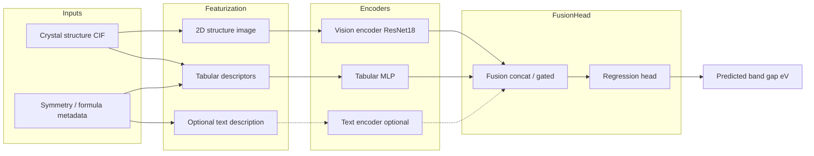

# Multimodal Materials Property Predictor

**A physicist applying ML/AI to design a multimodal materials property predictor**

Band-gap regression from crystal structure images + tabular descriptors (+ optional text).

This repository shows how a **physicist** can translate domain knowledge about electronic structure and materials into a working **multimodal machine learning system**: choosing a physically meaningful target (band gap), engineering scientifically valid descriptors, avoiding target leakage, comparing strong baselines, fusing structure images with tabular features, and deploying a reproducible inference stack.

| | |
| --- | --- |
| **Perspective** | Physicist applying ML / AI |
| **Task** | Regression |
| **Target** | Electronic band gap |
| **Unit** | eV |
| **Modalities (V1)** | Structure image + tabular descriptors |
| **Optional modality** | Deterministic text metadata |
| **Framework** | PyTorch, scikit-learn, FastAPI, Streamlit, MLflow |
| **Python** | ≥ 3.11 |

> **Scientific disclaimer:** Reported metrics reflect predictive **correlation** under a defined dataset, split, and training budget. They do **not** imply causation, calibrated physical uncertainty, or materials discovery claims.

> **AI assistance disclosure:** This project was developed **with the help of an AI coding assistant** (Cursor). The AI assisted with scaffolding, implementation, documentation, and debugging. Scientific problem framing, physics constraints, review, experiment decisions, and final responsibility remain with the author.

---

## Table of contents

1. [Motivation](#1-motivation)
2. [What this project demonstrates](#2-what-this-project-demonstrates)
3. [System architecture](#3-system-architecture)
4. [Scientific problem](#4-scientific-problem)
5. [Inputs and modalities](#5-inputs-and-modalities)
6. [Dataset pipeline](#6-dataset-pipeline)
7. [Dataset splits](#7-dataset-splits)
8. [Baseline models](#8-baseline-models)
9. [Multimodal model](#9-multimodal-model)
10. [Training](#10-training)
11. [Results](#11-results)
12. [Ablation study](#12-ablation-study)
13. [Explainability](#13-explainability)
14. [Uncertainty estimation](#14-uncertainty-estimation)
15. [API](#15-api)
16. [Streamlit UI](#16-streamlit-ui)
17. [MLOps and reproducibility](#17-mlops-and-reproducibility)
18. [Repository structure](#18-repository-structure)
19. [Installation](#19-installation)
20. [Quickstart](#20-quickstart)
21. [Configuration](#21-configuration)
22. [Docker](#22-docker)
23. [Tests and quality](#23-tests-and-quality)
24. [Critical scientific rules](#24-critical-scientific-rules)
25. [Limitations](#25-limitations)
26. [Roadmap](#26-roadmap)
27. [AI assistance](#27-ai-assistance)
28. [License](#28-license)

---

## 1. Motivation

In condensed-matter and materials physics, properties such as the **electronic band gap** depend on both **chemical composition** and **crystal structure**. A physicist already reasons in terms of orbitals, bonding, lattice geometry, and symmetry — ML/AI can operationalize that intuition at scale.

This project is therefore framed as:

> **Can a physicist apply modern ML/AI methods to design a multimodal materials property predictor that respects scientific constraints while remaining reproducible and deployable?**

Classical tabular models use composition and lattice descriptors effectively. Structure images may encode complementary geometric patterns. The practical ML question becomes:

> **Does multimodal fusion of structure images and tabular descriptors improve band-gap prediction compared with strong tabular baselines?**

The answer is evaluated with baselines, ablations, and honest reporting — including cases where multimodal models do *not* beat trees on a small demo corpus. That critical stance is part of doing physics-informed ML carefully.

---

## 2. What this project demonstrates

For a physicist moving into applied ML/AI, this repository demonstrates the full loop from physical problem → model → evaluation → deployment:

| Area | Implementation |
| --- | --- |
| Physics-informed problem setup | Band-gap regression with clear units and no target leakage |
| Data engineering | Download/demo acquisition → validation audit → descriptors → images → cached processed dataset |
| Computer vision | Automatic 2D structure rendering + pretrained ResNet18 encoder |
| Tabular ML | Dummy, Random Forest, Extra Trees, XGBoost, MLP baselines |
| Multimodal DL | Per-modality encoders + fusion + regression head |
| Evaluation | MAE, RMSE, R², scatter plots, ablation table |
| Explainability | Tabular importance + Grad-CAM overlays |
| Uncertainty | Monte Carlo dropout predictive std (explicitly uncalibrated) |
| Deployment | FastAPI + Streamlit |
| Containers | Dockerfile + Docker Compose |
| Experiment tracking | MLflow (SQLite backend) |
| Reproducibility | YAML configs, seeds, validation reports, gitignore for raw data |

---

## 3. System architecture



**Version 1 fusion:** modality embeddings are concatenated, projected, and passed to an MLP regression head.  
**Extensibility:** gated fusion is implemented and selectable via `model.fusion.method` in config.

More detail: [`docs/architecture.md`](docs/architecture.md).

---

## 4. Scientific problem

### Primary target (Version 1)

Predict the **electronic band gap** \(E_g\) in electron-volts:

\[
f(\text{structure image},\ \text{tabular descriptors})\ \rightarrow\ \hat{E}_g
\]

### Why band gap?

- Central quantity in semiconductor and optoelectronics physics
- Clear physical meaning and units (eV)
- Continuous regression target well suited to supervised ML
- Widely available in Materials Project-style datasets

A physicist choosing band gap as the Version 1 target keeps the ML problem anchored to a property that is both scientifically meaningful and measurable.

### Alternative targets (future)

Formation energy, density, or stability-related quantities can reuse the same pipeline by changing the target column and configs.

---

## 5. Inputs and modalities

### Modality 1 — Structure image

Automatically generated from CIF / pymatgen structures (never drawn manually):

- Atoms as colored spheres (CPK-inspired palette)
- Neighbor bonds when distance ≤ threshold
- PCA-based standardized 2D projection
- Fixed canvas size (default 224×224)
- Clean white background

Implementation: `src/materials_ai/data/image_generation.py`

### Modality 2 — Tabular descriptors

Scientifically motivated features **without target leakage**:

| Family | Examples |
| --- | --- |
| Composition | Elemental fractions over a fixed vocabulary |
| Atomic stats | Atomic-number mean/std/max |
| Chemistry stats | Electronegativity mean/std, atomic-radius mean/std |
| Geometry | Volume, density, lattice \(a,b,c,\alpha,\beta,\gamma\) |
| Counts | Number of atoms, number of elements |
| Symmetry | Crystal-system one-hot |

**Explicitly excluded:** `band_gap`, formation energy, energy-above-hull, and related targets.

Feature dimension on the demo run: **72**.

### Modality 3 — Text (optional)

Deterministic short description derived only from input features, e.g.:

> Crystal material containing Si with cubic symmetry and 2 atoms in the unit cell.

Architecturally supported. Version 1 defaults to **image + tabular**; text can be enabled in ablation / config. Without `sentence-transformers`, a lightweight hash encoder is used so the pathway remains runnable.

---

## 6. Dataset pipeline

```text
acquire (demo | Materials Project)
  → validate + audit removals
  → generate structure images
  → extract descriptors + text
  → train/val/test split
  → fit scaler on train only
  → cache model-ready artifacts
```

### Directory layout

```text
data/
  raw/         # manifests + CIF files (gitignored payloads)
  processed/   # parquet/csv, scaler, meta, validation report
  images/      # generated structure PNGs
```

Large raw datasets are **never** committed to Git.

### Sources

| Source | Command | Notes |
| --- | --- | --- |
| **Demo** (default) | `--source demo` | Offline, reproducible, ~120 samples |
| **Materials Project** | `--source mp` | Requires `MP_API_KEY` + `pip install '.[mp]'` |

### Demo dataset notes

- Curated semiconductors/oxides with literature-like band gaps
- Light lattice/gap perturbations to reach pipeline scale
- Intended for **engineering reproducibility and CI**, not DFT-grade scientific reporting

### Validation audit

Every filtering reason is counted and written to:

`data/processed/validation_report.json`

Example from the executed demo run:

| Metric | Value |
| --- | ---: |
| Input samples | 120 |
| Output samples | 120 |
| Removed | 0 |

---

## 7. Dataset splits

Default ratios: **70% train / 15% validation / 15% test** with deterministic seeds.

| Strategy | Behavior | When to use |
| --- | --- | --- |
| `random` | i.i.d. shuffle split | Tiny demo corpora |
| `composition` | Group by reduced element set | Materials Project / scientific generalization |

**Important difference**

- Random split can place chemically near-identical (or augmented) materials in both train and test → **optimistic metrics**
- Composition split keeps related chemistries together → harder, more realistic generalization test

**Defaults**

- Demo source → `random` (few unique element-set groups; composition becomes severely OOD)
- Materials Project → `composition`

Executed demo split counts (seed=42):

| Split | Count |
| --- | ---: |
| Train | 83 |
| Val | 18 |
| Test | 19 |

---

## 8. Baseline models

Strong tabular baselines are mandatory before claiming multimodal gains:

1. **Dummy mean predictor**
2. **Random Forest**
3. **Extra Trees**
4. **XGBoost** (optional extra: `[boost]`)
5. **Tabular MLP** (PyTorch)

All report **MAE**, **RMSE**, and **R²** on the held-out test set.

```bash
python scripts/train_baseline.py --config configs/baseline.yaml
```

Artifacts: `outputs/models/baselines/`, `outputs/figures/baseline_metrics.json`

---

## 9. Multimodal model

### Vision encoder

- Backbone: ResNet18 (EfficientNet-B0 supported)
- ImageNet-pretrained weights (configurable)
- Freeze / unfreeze via `model.vision.freeze`
- Projection to a fixed embedding (default 256-D)

### Tabular encoder

```text
features → Linear → LayerNorm → GELU → Dropout → … → embedding (default 128-D)
```

### Text encoder (optional)

- Preferred: sentence-transformers / HF transformer
- Fallback: deterministic character-hash bag embedding + MLP

### Fusion

1. Encode each enabled modality independently  
2. Fuse embeddings (`concat` or `gated`)  
3. MLP regression head → scalar band gap  

```bash
python scripts/train_multimodal.py --config configs/multimodal.yaml
```

---

## 10. Training

PyTorch training supports:

| Feature | Status |
| --- | --- |
| GPU / CPU | Automatic |
| Mixed precision | Configurable |
| Early stopping | Patience-based on val MAE |
| Gradient clipping | Configurable |
| LR scheduler | Cosine / step / none |
| Checkpointing | Best-by-val-MAE |
| Resume | Via config `training.resume` |
| Deterministic seed | Global seed helper |
| Batch size / epochs | YAML + CLI override |

Tracked in MLflow: model type, hyperparameters, train/val losses, MAE/RMSE/R², dataset version, git commit (when available).

---

## 11. Results

All numbers below come from **executed experiments** on the demo dataset  
(`n=120`, random split, `seed=42`). They are **not fabricated**.

### Tabular baselines

| Model | MAE | RMSE | R² |
| --- | ---: | ---: | ---: |
| Mean baseline | 1.212 | 1.544 | -0.000 |
| Random Forest | 0.068 | 0.083 | 0.997 |
| Extra Trees | **0.061** | **0.074** | **0.998** |
| XGBoost | 0.074 | 0.092 | 0.996 |
| Tabular MLP | 0.085 | 0.108 | 0.995 |

### Multimodal / ablation (equal budget: 8 epochs)

| Model | MAE | RMSE | R² |
| --- | ---: | ---: | ---: |
| Tabular only (NN) | 1.097 | 1.594 | -0.066 |
| Image only | 1.105 | 1.467 | 0.098 |
| Image + Tabular | 1.180 | 1.588 | -0.058 |
| Image + Tabular + Text | 0.937 | 1.332 | 0.256 |

### Longer multimodal run (12 epochs, image + tabular)

| Model | MAE | RMSE | R² |
| --- | ---: | ---: | ---: |
| Image + Tabular | 0.454 | 0.983 | 0.595 |

### Interpretation

1. On this **small demo corpus**, tree models dominate because tabular chemistry/geometry features are highly informative and near-duplicates can leak under random split.
2. Multimodal fusion is **not automatically better** under short neural training budgets — an important, honest portfolio takeaway.
3. Longer image+tabular training improves over short ablations (MAE 1.18 → 0.45) but still trails Extra Trees on this demo.
4. Re-run with Materials Project + composition splits before making scientific performance claims.

### Result artifacts

| Path | Contents |
| --- | --- |
| `outputs/figures/baseline_metrics.json` | Baseline metrics |
| `outputs/figures/ablation_metrics.json` | Ablation metrics |
| `outputs/figures/multimodal_metrics.json` | Main multimodal metrics |
| `outputs/figures/eval_scatter.png` | True vs predicted scatter |
| `outputs/explanations/` | Example explanation reports + Grad-CAM |
| `outputs/models/multimodal_best.pt` | Best multimodal checkpoint |

---

## 12. Ablation study

The ablation answers:

> **Does multimodal fusion actually improve prediction under a matched training budget?**

Runs (configurable in `configs/multimodal.yaml`):

1. Tabular only  
2. Image only  
3. Image + tabular  
4. Image + tabular + text  

```bash
python scripts/run_ablation.py --config configs/multimodal.yaml --epochs 8
```

On the demo run, equal-budget neural ablations do **not** beat strong tree baselines. That negative/nuanced result is intentional portfolio evidence of critical evaluation, not only leaderboard chasing.

---

## 13. Explainability

### Tabular

Tree feature importance weighted by absolute scaled feature magnitude (SHAP available as fallback pathway).

### Image

Grad-CAM on ResNet `layer4` for structure-image attention overlays.

### Example (demo-Si)

```text
Predicted band gap: 1.22 eV
True band gap: 1.12 eV
Absolute error: 0.10 eV

Important tabular factors:
  - atomic_number_max
  - atomic_number_mean
  - density
  - electronegativity_mean
  - n_atoms
```

```bash
python scripts/explain.py --checkpoint outputs/models/multimodal_best.pt
```

Outputs:

- `outputs/explanations/<material_id>_report.txt`
- `outputs/explanations/<material_id>_gradcam.png`

---

## 14. Uncertainty estimation

Version 1 uses **Monte Carlo dropout**:

1. Enable dropout at inference  
2. Sample \(N\) stochastic forward passes  
3. Report mean prediction and predictive standard deviation  

Example API/UI presentation:

```text
prediction = 1.94 eV
uncertainty = ±0.52 eV
```

> This is **not** a calibrated scientific confidence interval unless explicit calibration has been performed (it has not, in V1).

---

## 15. API

FastAPI inference service:

```bash
uvicorn materials_ai.api.main:app --reload --port 8000
```

### Endpoints

#### `GET /health`

Returns service status and whether a checkpoint is present.

#### `POST /predict`

Request:

```json
{
  "material_id": "demo-Si",
  "n_uncertainty": 20
}
```

or

```json
{
  "structure_path": "data/raw/structures/demo-Si.cif",
  "n_uncertainty": 20
}
```

Response:

```json
{
  "prediction": 1.94,
  "unit": "eV",
  "uncertainty": 0.52,
  "model_version": "v1",
  "inputs_used": ["image", "tabular"],
  "material_id": "demo-Si",
  "note": "Uncertainty is MC-dropout predictive std, not a calibrated confidence interval."
}
```

#### `POST /predict/upload`

Upload a CIF / structure file as multipart form data.

Interactive docs: [http://localhost:8000/docs](http://localhost:8000/docs)

---

## 16. Streamlit UI

```bash
streamlit run app/streamlit_app.py
```

Users can:

1. Select a catalog material or upload a structure  
2. Inspect the structure visualization  
3. View extracted descriptors  
4. Run prediction  
5. See predicted band gap + MC-dropout uncertainty  
6. Inspect explainability artifacts when available  

Keep the UI simple and professional — suitable for demos and portfolio walkthroughs.

---

## 17. MLOps and reproducibility

| Practice | Detail |
| --- | --- |
| Configs | `configs/baseline.yaml`, `configs/multimodal.yaml` |
| Seeds | Global Python / NumPy / PyTorch seeding |
| Tracking | MLflow SQLite at `outputs/mlflow/mlflow.db` |
| Versioning | Checkpoint metadata includes modalities + encoder dims |
| Logging | Structured package logger |
| Secrets | `.env.example` only — never commit API keys |
| Data policy | Raw/processed payloads gitignored |
| Containers | `Dockerfile` + `docker-compose.yml` |

Environment template: [`.env.example`](.env.example)

---

## 18. Repository structure

```text
MultimodalMaterialsPropertyPredictor/
├── README.md
├── LICENSE
├── pyproject.toml
├── Dockerfile
├── docker-compose.yml
├── Makefile
├── .env.example
├── .gitignore
│
├── configs/
│   ├── baseline.yaml
│   └── multimodal.yaml
│
├── src/materials_ai/
│   ├── config.py
│   ├── logging_utils.py
│   ├── utils.py
│   ├── baselines.py
│   ├── model_factory.py
│   ├── mlflow_utils.py
│   ├── data/
│   │   ├── download.py
│   │   ├── validation.py
│   │   ├── preprocessing.py
│   │   ├── descriptors.py
│   │   ├── image_generation.py
│   │   └── dataset.py
│   ├── models/
│   │   ├── vision_encoder.py
│   │   ├── tabular_encoder.py
│   │   ├── text_encoder.py
│   │   ├── fusion.py
│   │   └── multimodal_model.py
│   ├── training/
│   │   ├── trainer.py
│   │   ├── evaluation.py
│   │   └── checkpointing.py
│   ├── explainability/
│   │   ├── tabular.py
│   │   └── vision.py
│   ├── inference/
│   │   └── predictor.py
│   └── api/
│       └── main.py
│
├── scripts/
│   ├── prepare_dataset.py
│   ├── train_baseline.py
│   ├── train_multimodal.py
│   ├── run_ablation.py
│   ├── evaluate.py
│   └── explain.py
│
├── app/
│   └── streamlit_app.py
│
├── docs/
│   └── architecture.md
│
├── tests/
│   ├── test_core.py
│   └── test_e2e_smoke.py
│
├── data/          # raw / processed / images
└── outputs/       # models / figures / explanations / mlflow
```

---

## 19. Installation

### Requirements

- Python **≥ 3.11** (developed/verified with 3.12)
- Optional: CUDA GPU for faster training
- Optional: Materials Project API key

### Setup

```bash
git clone <your-repo-url>
cd MultimodalMaterialsPropertyPredictor

python -m venv .venv

# Windows (Git Bash)
source .venv/Scripts/activate

# Linux / macOS
# source .venv/bin/activate

pip install -U pip
pip install -e ".[dev,boost]"
```

### Optional extras

```bash
pip install -e ".[mp]"     # Materials Project client
pip install -e ".[text]"   # sentence-transformers text pathway
pip install -e ".[all]"    # everything
```

Copy environment template:

```bash
cp .env.example .env
# set MP_API_KEY=... if using Materials Project
```

---

## 20. Quickstart

End-to-end local workflow:

```bash
# 1) Dataset
python scripts/prepare_dataset.py --source demo --n-samples 120

# 2) Baselines
python scripts/train_baseline.py --config configs/baseline.yaml

# 3) Multimodal model
python scripts/train_multimodal.py --config configs/multimodal.yaml

# 4) Ablations
python scripts/run_ablation.py --config configs/multimodal.yaml --epochs 8

# 5) Evaluation plot
python scripts/evaluate.py --checkpoint outputs/models/multimodal_best.pt

# 6) Explainability
python scripts/explain.py --checkpoint outputs/models/multimodal_best.pt

# 7) API
uvicorn materials_ai.api.main:app --reload --port 8000

# 8) UI
streamlit run app/streamlit_app.py
```

Or use Make targets (`install`, `data`, `baselines`, `multimodal`, `ablation`, `evaluate`, `explain`, `test`, `api`, `ui`).

### Materials Project path

```bash
export MP_API_KEY=your_key_here
python scripts/prepare_dataset.py --source mp --n-samples 500 --split-strategy composition
```

---

## 21. Configuration

### `configs/baseline.yaml`

Controls tabular baseline hyperparameters, split metadata, and MLflow experiment name.

### `configs/multimodal.yaml`

Controls:

- Enabled modalities (`image` / `tabular` / `text`)
- Vision backbone, freeze flag, embedding size
- Tabular / text encoder dims
- Fusion method (`concat` | `gated`)
- Training hyperparameters
- Uncertainty sampling
- Ablation matrix

Example modality block:

```yaml
modalities:
  image: true
  tabular: true
  text: false
```

---

## 22. Docker

```bash
docker compose up --build
```

| Service | URL |
| --- | --- |
| API | http://localhost:8000/health |
| UI | http://localhost:8501 |

Mounts local `data/` and `outputs/` so trained checkpoints and datasets persist on the host.

---

## 23. Tests and quality

```bash
ruff check .
pytest -q -m "not slow"
mypy src/materials_ai --ignore-missing-imports
pytest -q -m slow   # end-to-end smoke: data → train 1 epoch → predict
```

Quality stack:

- **ruff** — lint / import hygiene  
- **pytest** — unit + e2e smoke  
- **mypy** — typed package checks where reasonable  

Code conventions: type hints, pathlib, Pydantic configs, structured logging, small focused modules.

---

## 24. Critical scientific rules

1. **No target leakage** — band gap is never used as an input feature.  
2. **No discovery claims** from demo performance alone.  
3. **Correlation ≠ causation** — clearly stated in UI and docs.  
4. **Missing values / filtering** are audited with removal counts.  
5. **Scaler fit on train only** — applied to val/test afterward.  
6. **Uncertainty wording** distinguishes MC-dropout std from calibrated intervals.  

---

## 25. Limitations

- Demo dataset is for pipeline/CI reproducibility, not DFT-grade benchmarking  
- Random-split demo metrics are optimistic due to near-duplicate leakage risk  
- Strong tree baselines currently outperform short-budget multimodal NNs on demo data  
- Text encoder defaults to a hash fallback unless `[text]` extras are installed  
- MC-dropout uncertainty is uncalibrated  
- Image rendering is a 2D projection heuristic, not a full crystallographic standard view for all space groups  

---

## 26. Roadmap

**Near-term**

- [ ] Materials Project runs with composition-aware splits and public metric refresh  
- [ ] Unfreeze / fine-tune vision backbone  
- [ ] Enable sentence-transformers text pathway by default when deps present  
- [ ] Attention-based fusion comparison  

**Later**

- [ ] Deep ensembles + uncertainty calibration  
- [ ] Larger property set (formation energy, density)  
- [ ] Hugging Face Hub model/dataset cards  
- [ ] Harder OOD evaluation by crystal system / chemistry family  

---

## 27. AI assistance

This repository was written and iteratively developed **with assistance from an AI coding assistant** (Cursor Agent), used as a productivity tool while designing the system from a **physics + ML** perspective.

The AI contributed to:

- Project scaffolding and package structure
- Implementation of data, model, training, API, and UI modules
- Configuration, Docker, tests, and documentation (including this README)
- Debugging, refactoring, and verification commands

Human (physicist) ownership covered:

- Defining the scientific problem and Version 1 scope
- Choosing band gap as a physically meaningful target
- Setting constraints (no target leakage, honest metrics, reproducible pipeline)
- Reviewing architecture and interpreting results scientifically
- Deciding experiment setups and accepting final outputs

This disclosure is included for transparency: a physicist can apply ML/AI effectively, including with modern AI-assisted development workflows, while remaining accountable for scientific validity.

---

## 28. License

MIT License — see [`LICENSE`](LICENSE).

---

## Acknowledgments

- AI development assistance: [Cursor](https://cursor.com/)
- Structure handling: [pymatgen](https://pymatgen.org/), [ASE](https://wiki.fysik.dtu.dk/ase/)
- Optional data source: [Materials Project](https://materialsproject.org/)
- Vision / DL: PyTorch, torchvision
- Tracking: MLflow
- Serving: FastAPI, Streamlit

---

**Bottom line:** this repository shows that a **physicist can apply ML/AI** to design a scientifically careful, reproducible **multimodal materials property predictor** — from physical problem formulation and descriptor design through training, ablation, explainability, uncertainty, and deployment — not merely chase the lowest error on a toy split.
